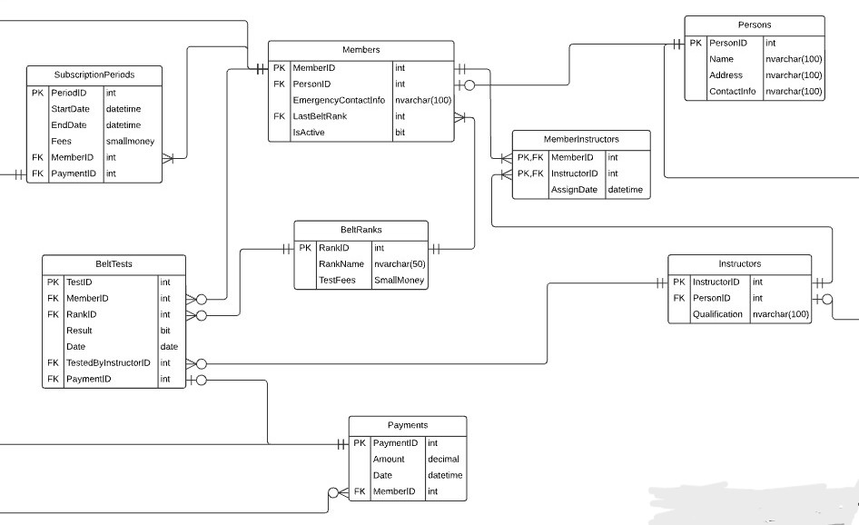

# 🥋 Karate Club Management System

A backend-focused management system built using **C#**, **ASP.NET Core**, **ADO.NET**, and **SQL Server**, following a clean **Three-Tier Architecture** (Data Access, Business Logic, Presentation) with **DTOs**.

The system is designed to manage core karate club operations including members, instructors, belt ranks, belt tests, subscriptions, and payments, ensuring strong data integrity through a well-structured relational database.

Database operations are handled using **ADO.NET** and **stored procedures**, providing high performance, scalability, and maintainability suitable for real-world scenarios.

---

## 🗄 Database Design

The database schema is fully normalized and enforces relationships using primary and foreign keys. It supports transactional workflows such as membership subscriptions, belt testing fees, and payment tracking while maintaining data consistency.

---

## 🛠 Technologies Used

- C#
- ASP.NET Core Web API
- ADO.NET
- SQL Server
- Three-Tier Architecture
- DTOs
- Stored Procedures

---

## ✨ Key Features

- Member and instructor management  
- Belt rank tracking and belt test evaluations  
- Subscription period management  
- Payment and fee processing  
- Clean separation of concerns using Three-Tier Architecture  
- Secure and efficient database access using ADO.NET  

---

## 🏗 Architecture Overview

The application follows a Three-Tier Architecture:

- **Data Access Layer (DAL):** Handles all database operations using ADO.NET and stored procedures  
- **Business Logic Layer (BLL):** Implements business rules and validations  
- **Presentation Layer (API):** Exposes RESTful endpoints using ASP.NET Core Web API  

DTOs are used to transfer data between layers, ensuring loose coupling and maintainability.

---

## 🎯 Project Purpose

This project demonstrates strong backend development skills, relational database design, and clean architecture principles using the Microsoft .NET stack. It is suitable as a portfolio project for .NET backend or full-stack developer roles.
